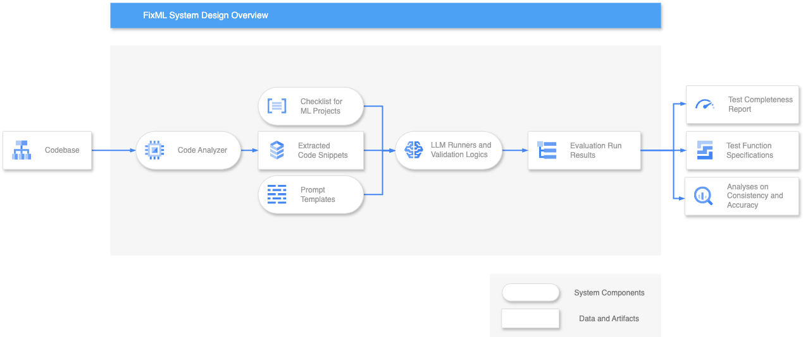

# Using the API

Beside the CLI tool offered, one can also make use of the package's 
high-level, modular API to replicate the workflow inside their Python 
environments. 

Here is a high-level overview of the FixML system:



There are five main components in the FixML system:

1.  **Code Analyzer** 

It extracts test suites from the input codebase, to ensure only the most
relevant details are provided to LLMs given token limits.

2.  **Prompt Templates** 

It stores prompt templates for instructing LLMs to generate responses in the
expected format.

3.  **Checklist** 

It reads the curated checklist from a CSV file into a dictionary with a fixed
schema for LLM injection. The package includes a default checklist for
distribution.

4.  **Runners** 

It includes the Evaluator module, which assesses each test suite file using LLMs
and outputs evaluation results, and the Generator module, which creates test
specifications. Both modules feature validation, retry logic, and record
response and relevant information.

5.  **Parsers** 

It reads the report templates and converts Evaluator's responses into evaluation
reports in various formats (QMD, HTML, PDF) using the Jinja template engine,
which enables customizable report structures.

```{note}
The workflows used in the package have been designed to be fully modular. You
can easily switch between different prompts, models and checklists to use. You
can also write your own custom classes to extend the capability of this library.
```

For more usage and examples, refer to <a href="./autoapi">API Reference</a>.